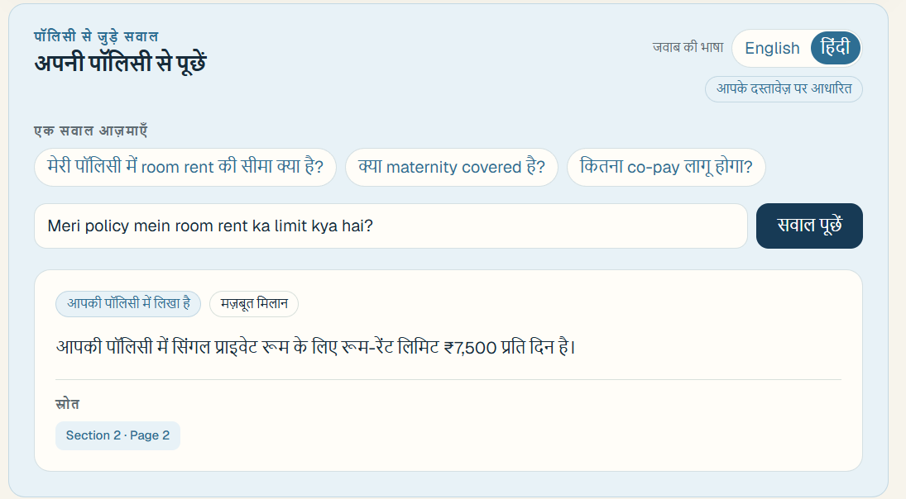

# [MedBud](https://www.medbud.space/)

MedBud is a healthcare transparency app that helps people understand hospital bills, medicine prices, procedures, and insurance policies.

It gives patients evidence and context to ask better questions about what they are being charged and what their insurance may cover. MedBud does not diagnose patients or decide whether a charge is illegal.

## What it does

### Review hospital bills

- Upload a hospital bill or estimate.
- Extract medicines, procedures, tests, consumables, and charges.
- Compare supported medicines with NPPA and Jan Aushadhi reference data.
- Compare supported procedures with CGHS reference rates.
- Identify duplicate, unclear, unusual, or overlapping charges.
- Show evidence and suggest questions to ask the hospital.

### Understand insurance policies

- Upload an insurance policy.
- Summarize room-rent limits, co-pay, deductibles, waiting periods, exclusions, and sub-limits.
- Ask questions about the policy and receive page-level citations.

#### Multilingual policy questions

Policy Q&A supports English and Hindi answers, including Hindi and Hinglish questions. The user
selects the answer language explicitly. MedBud keeps the original question separate from a compact
English retrieval query, retrieves the original English policy text, and answers in the selected
language without changing policy values or citations.

```text
Hindi / Hinglish question
  ↓
compact English retrieval terms
  ↓
English policy clause + deterministic facts
  ↓
Hindi or English explanation with the same page citation
```

Example: `Meri policy mein room rent ka limit kya hai?` can return a Hindi explanation grounded in
the English policy clause, with the original section and page shown as the source.



#### App-wide language support

The English/Hindi selector is available across the app shell, home page, dashboard, authentication,
new-check flow, upload and processing states, document details, summaries, findings, checklists, and
policy comparisons. The selected locale persists across refreshes. UI copy is localized from a shared
catalog so additional Indian languages can be added without changing canonical medicine/procedure
identities, source quotes, citations, policy text, or deterministic calculations.

### Compare a bill with a policy

When both documents are available, MedBud estimates:

- applicable policy limits
- deductible and co-pay impact
- insurer payment
- patient responsibility

The calculations are performed deterministically in code. AI is used to understand documents and explain results.

## Engineering decisions

MedBud uses different approaches depending on the type of problem rather than using AI for every step.

### Structured references instead of AI-generated prices

Medicine and procedure prices are treated as structured data.

NPPA, PMBI / Jan Aushadhi, and CGHS reference data is parsed, normalized, validated, and stored in Postgres. Audits query these records directly instead of asking an LLM to estimate what something should cost.

Reference imports are versioned so older observations are retained when official rates change.

### Deterministic matching and calculations

AI is used for document understanding, but it does not make the final pricing or insurance decision.

Medicine identity, units, reference matching, duplicate checks, price differences, deductibles, co-pay, and insurance calculations are handled in code.

Exact structured matches are preferred. Fuzzy matching can surface possible candidates, but uncertain matches require review rather than automatically producing a comparison.

### Policy retrieval

Insurance policies can be large, so MedBud does not send the complete document to the model for every question.

Policies are split into page and section-aware chunks and stored for retrieval. PostgreSQL full-text search selects relevant chunks for a question, and only that context is provided to the model.

This keeps policy answers smaller, grounded in the uploaded document, and able to cite the relevant pages.

### Large document processing

Large documents are processed in bounded chunks rather than as one model request.

Chunk results are merged into a structured policy summary while preserving page and section information. Conflicting information is not silently resolved when the system cannot determine which value applies.

### Evidence lineage

Important findings retain the path used to produce them:

document → page → extracted item → normalized entity → reference observation → rule/calculation → finding

This allows the UI to explain why something was flagged instead of presenting an unsupported AI conclusion.

### Reference ingestion

Official reference data follows a small ingestion pipeline:

source document → parsing → normalization → validation → versioned snapshot → Postgres

Accepted snapshots are used by the audit engine while older snapshots remain available for history and reproducibility.


## Stack

- Next.js 16
- TypeScript
- Tailwind CSS
- Supabase Auth, Postgres, and Storage
- Groq
- PostgreSQL full-text search
- Docker

## Run locally

### Prerequisites

- Node.js 22.x
- A Supabase project, or Docker and the Supabase CLI for local Supabase
- A Groq API key

### Configure environment variables

Create `healthcare-check/.env.local`:

```env
NEXT_PUBLIC_SUPABASE_URL=your-supabase-url
NEXT_PUBLIC_SUPABASE_ANON_KEY=your-supabase-anon-key
SUPABASE_SERVICE_ROLE_KEY=your-supabase-service-role-key
SUPABASE_DB_URL=your-supabase-database-url
GROQ_API_KEY=your-groq-api-key
```

Create a private Supabase Storage bucket named `documents` for uploaded bills and policies.

### Set up Supabase

Run these commands from the `healthcare-check` directory.

For a hosted Supabase project:

```bash
npx supabase link --project-ref your-project-ref
npx supabase db push
```

For local Supabase:

```bash
npx supabase start
npx supabase db reset
npx supabase status
```

Use the local URLs and keys printed by `npx supabase status` in `.env.local`.

### Start the app

From the repository root:

```bash
cd healthcare-check
npm install
npm run dev
```

Open [http://localhost:3000](http://localhost:3000).

### Docker Compose

Alternatively, put the environment variables in a `.env` file at the repository root and run:

```bash
docker compose up
```

## Testing

From the repository root:

```bash
cd healthcare-check
npm run lint
npm test
```

Tests cover medicine matching, policy extraction, insurance calculations, reference ingestion, CGHS behavior, and evidence handling.

## Product scope

MedBud is designed to surface items worth checking, show where information came from, and explain what to ask next. It is not a medical diagnosis tool, legal determination, or substitute for an insurer's final claim decision.
